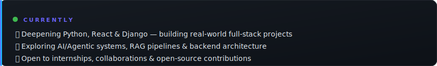
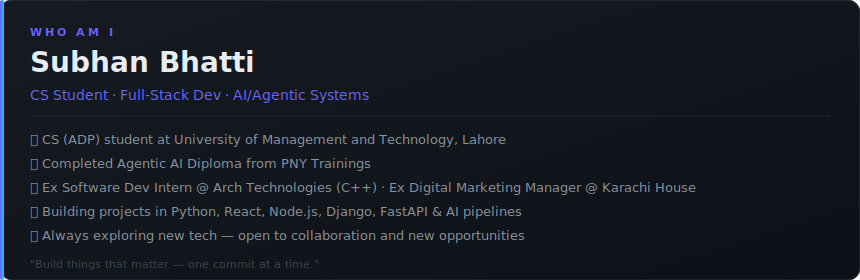

---

**✨ See what I'm currently up to**

### `👾 whoami`

> *"First, solve the problem. Then, write the code."* — **John Johnson**

### `🧰 tech stack`

 

### `📈 activity & contributions`

### `🐍 contribution snake`

### `📊 contribution graph`

### `🤝 Connect`

 

*Thanks for visiting — stats refresh daily via GitHub Actions* 🚀
